# 🔄 Gemini 2.5 Fine-Tuning Process Flowchart

## Overview
This flowchart illustrates the complete fine-tuning process for Gemini 2.5 models based on the whitepaper exercise and notebook implementation.

---

## 📊 Complete Fine-Tuning Workflow

```mermaid
graph TD
    A[🚀 Start Fine-Tuning Process] --> B[📋 Setup & Configuration]
    B --> C[🔧 Dataset Creation]
    C --> D[📤 Upload to GCS]
    D --> E[🎯 Start Training Job]
    E --> F[⏳ Monitor Progress]
    F --> G{Job Complete?}
    G -->|No| F
    G -->|Yes| H[✅ Get Tuned Model]
    H --> I[🧪 Test & Validate]
    I --> J[🚀 Deploy Model]

    %% Styling
    classDef startEnd fill:#e1f5fe,stroke:#01579b,stroke-width:3px
    classDef process fill:#f3e5f5,stroke:#4a148c,stroke-width:2px
    classDef decision fill:#fff3e0,stroke:#e65100,stroke-width:2px
    classDef success fill:#e8f5e8,stroke:#2e7d32,stroke-width:2px
    classDef critical fill:#ffebee,stroke:#c62828,stroke-width:2px

    class A,J startEnd
    class B,C,D,E,F,H,I process
    class G decision
    class H,I success
    class C,D critical
```

---

## 🔍 Detailed Process Breakdown

### Phase 1: Setup & Configuration

```mermaid
graph LR
    A[🔧 Project Setup] --> B[🌍 Region Selection]
    B --> C[🔑 Authentication]
    C --> D[📦 SDK Installation]
    D --> E[✅ Validation]
    
    A1[PROJECT_ID: periospot-mvp] --> A
    B1[REGION: us-central1] --> B
    C1[gcloud auth login] --> C
    D1[google-cloud-aiplatform] --> D
```

### Phase 2: Dataset Creation & Formatting

```mermaid
graph TD
    A[📝 Create Training Examples] --> B{Format Check}
    B -->|❌ Old Format| C[❌ input_text/output_text]
    B -->|✅ New Format| D[✅ contents structure]
    
    C --> E[🔄 Convert to New Format]
    E --> D
    
    D --> F[📄 Save as JSONL]
    F --> G[🔍 Validate Structure]
    
    subgraph "Correct Format Example"
        H["{<br/>  'contents': [<br/>    {'role': 'user', 'parts': [{'text': 'Q'}]},<br/>    {'role': 'model', 'parts': [{'text': 'A'}]}<br/>  ]<br/>}"]
    end
    
    G --> H
```

### Phase 3: Google Cloud Storage Upload

### Phase 4: Fine-Tuning Execution

```mermaid
graph TD
    A[🎯 Configure Training] --> B[🚀 Start Job]
    B --> C[📊 Job Monitoring]
    C --> D{Status Check}
    D -->|PENDING| E[⏱️ Wait 30s]
    D -->|RUNNING| E
    D -->|SUCCEEDED| F[✅ Complete]
    D -->|FAILED| G[❌ Error]
    
    E --> C
    
    subgraph "Training Configuration"
        H["source_model: gemini-2.5-pro<br/>train_dataset: gs://...<br/>tuned_model_name: custom-v1"]
    end
    
    A --> H
```

### Phase 5: Model Testing & Validation

```mermaid
graph TD
    A[🎯 Get Tuned Endpoint] --> B[🧪 Test Questions]
    B --> C[📊 Compare Responses]
    C --> D[📈 Performance Analysis]
    D --> E{Performance OK?}
    E -->|Yes| F[✅ Deploy]
    E -->|No| G[🔄 Retrain/Adjust]
    
    subgraph "Test Questions"
        H["What is machine learning?<br/>Explain neural networks<br/>What is fine-tuning?"]
    end
    
    B --> H
```

---

## 🎯 Key Training Data (From Whitepaper Exercise)

### Training Examples Used:
1. **Machine Learning Fundamentals**
   - Question: "What is machine learning?"
   - Answer: Comprehensive explanation of ML as AI subset

2. **Neural Networks Education**
   - Question: "Explain neural networks in simple terms"
   - Answer: Biological inspiration and computing systems

3. **Fine-Tuning Concepts**
   - Question: "What is fine-tuning in AI?"
   - Answer: Process of adapting pre-trained models

### Data Format Transformation:

```mermaid
graph LR
    A[❌ Old Format] --> B[✅ New Format]
    
    subgraph "Old (Doesn't Work)"
        C["{<br/>  'input_text': 'Question',<br/>  'output_text': 'Answer'<br/>}"]
    end
    
    subgraph "New (Required)"
        D["{<br/>  'contents': [<br/>    {'role': 'user', 'parts': [...]},<br/>    {'role': 'model', 'parts': [...]}<br/>  ]<br/>}"]
    end
    
    A --> C
    B --> D
```

---

## 🔧 Technical Requirements

### Environment Setup:
- **Project**: periospot-mvp
- **Region**: us-central1 (required for fine-tuning)
- **Model**: gemini-2.5-pro (or gemini-2.5-flash)
- **Storage**: Google Cloud Storage bucket
- **Authentication**: gcloud auth application-default login

### Critical Success Factors:
1. ✅ **Correct Dataset Format** - Use `contents` structure
2. ✅ **GCS Upload** - Local files not accepted
3. ✅ **Supported Model** - Only Gemini 2.5 models
4. ✅ **Proper Region** - us-central1 required
5. ✅ **Valid Authentication** - Google Cloud credentials

---

## 📊 Expected Outcomes

### Before Fine-Tuning:
- Generic AI responses to ML questions
- Inconsistent terminology and depth
- General-purpose knowledge

### After Fine-Tuning:
- Specialized AI/ML explanations
- Consistent educational tone
- Domain-specific expertise
- Improved accuracy on ML topics

---

## 🚨 Common Issues & Solutions

```mermaid
graph TD
    A[❌ Error] --> B{Error Type}
    
    B -->|Missing contents field| C[🔧 Fix Dataset Format]
    B -->|Local file error| D[📤 Upload to GCS]
    B -->|Model not supported| E[🎯 Use Gemini 2.5]
    B -->|Region error| F[🌍 Switch to us-central1]
    B -->|Auth error| G[🔑 Re-authenticate]
    
    C --> H[✅ Retry Training]
    D --> H
    E --> H
    F --> H
    G --> H
```

---

## 🎓 Learning Objectives (From Whitepaper)

This exercise demonstrates:
1. **Dataset Format Evolution** - Understanding new Gemini 2.5 requirements
2. **Cloud Infrastructure** - GCS integration for training data
3. **Model Specialization** - Creating domain-specific AI models
4. **Production Workflow** - End-to-end fine-tuning pipeline
5. **Error Handling** - Debugging and troubleshooting techniques

---

## 📈 Performance Metrics

### Training Metrics:
- **Dataset Size**: 3 examples (demonstration)
- **Training Time**: 15-30 minutes
- **Model Size**: Same as base model
- **Cost**: Based on Vertex AI pricing

### Quality Metrics:
- **Accuracy**: Improved on AI/ML topics
- **Consistency**: Standardized explanations
- **Relevance**: Domain-focused responses
- **Educational Value**: Clear, structured answers

---

**Status**: ✅ **Working Solution** - Complete fine-tuning pipeline operational

**Last Updated**: January 2025  
**Based On**: Whitepaper exercise + Notebook implementation
